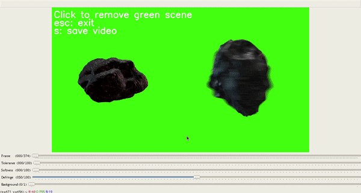

# Chroma Key

With this program you can apply chroma key technique to a video file, so the background can be change. Also you can save the video with the new background.

By clícking in the green scene you can remove the background and make adjustment for a better image.

## Dependencies
* Python >= 3.6
  * [Download Python](https://www.python.org/downloads/)
* OpenCV >= 4.1
  * Ubuntu: [Install OpenCV-Python in Ubuntu](https://docs.opencv.org/master/d2/de6/tutorial_py_setup_in_ubuntu.html)
  * Fedora: [Install OpenCV-Python in Fedora](https://docs.opencv.org/master/dd/dd5/tutorial_py_setup_in_fedora.html)
  * Windows: [Install OpenCV-Python in Windows](https://docs.opencv.org/master/d5/de5/tutorial_py_setup_in_windows.html)
* Numpy >= 1.18
  * [Installing NumPy](https://numpy.org/install/)

## Basic execution
1. Clone this repo
2. Open the terminal in the top level directory
3. Run it: `python3 chroma.py`

In `chroma.py`, you can change the video and the image for the backaground:
* In line 234, `cap = cv2.VideoCapture("greenscreen-asteroid.mp4")`, you could change `"greenscreen-asteroid.mp4"` for your video path
* in line 243, `bg = cv2.imread("space.jpg", cv2.IMREAD_COLOR)`, you could change `"space.jpg"` for your image background path
